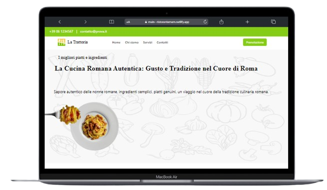
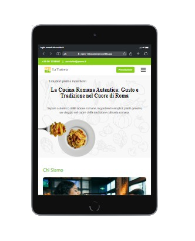
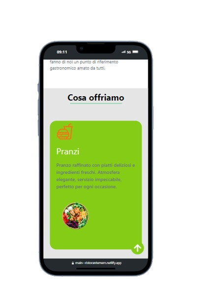
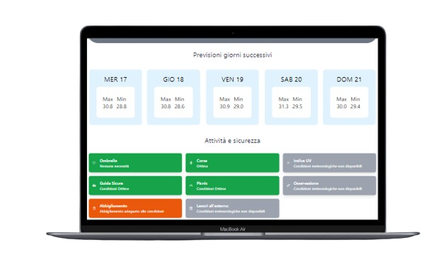
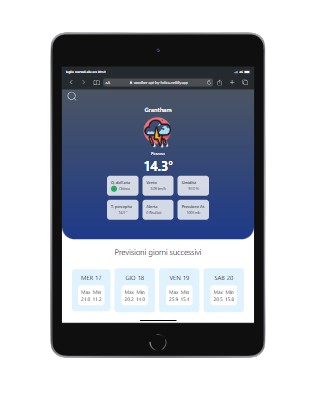
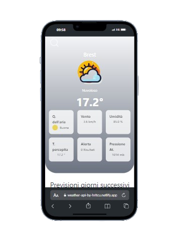

<h1 align="center">Ciao 👋, sono Stefan Hritcu</h1>
<h2 align="center">Front End Developer</h2>

<table>
  <tr>
    <td>
      <section>
        
      </section>
    </td>
    <td style="padding-left: 20px;">
      

        Mi chiamo Stefan Hritcu e sono uno sviluppatore web autodidatta. Ho intrapreso questo percorso di studi con passione e dedizione, deciso a trasformare la mia curiosità per il web in una carriera professionale. 
        Con oltre 9 mesi di studio intensivo, ho sviluppato un forte interesse per il frontend development, dedicandomi a progetti personali per mettere in pratica le competenze acquisite e ampliare il mio portfolio.
        ## - Sono nato in Romania e ho vissuto in diversi paesi europei durante la mia vita:
        - Dall'età di 8 anni fino ai 20 anni ho vissuto in Italia.
        - Dai 20 ai 21 anni ho vissuto in Spagna.
        - Dai 21 anni fino ad oggi (30 anni) vivo in Germania.
      

      <h3>Hard Skills</h3>
     

        
        
        
        
        
        
        
        
        
        
       
       
       

      

    </td>
  </tr>
</table>

## Soft Skills

- **Corso Practitioner in Programmazione Neuro Linguistica (PNL)**
- **ChatGPT**
- **Madrelingua: rumeno e italiano; Ottime conoscenze: tedesco e spagnolo; Conoscenze di base: inglese e francese**
  
- **Scomposizione dei problemi in micro-problemi**
- **Mentalità algoritmica**
- **Esperienze di adattamento acquisite in contesti stranieri**
- **Capacità di ascoltare, comprendere e risolvere compiti lavorativi assegnati in contesti diversi e internazionali**
- **Esperienza lavorativa in diversi paesi: Romania, Germania, Italia, Francia e Spagna**

## ---------------------------------------------> Progetti <---------------------------------------------

### 01 - Progetto Ristorante con Stack MERN

  
  
  

**GitHub Repository/ Codice:** [Progetto Ristorante Stack MERN](https://github.com/StefanHritcu/Progetto-Ristorante-Stack-MERN) **Qui troverai la descrizione completa**

**Link del sito con Netlify:** [ristorantemern.netlify.app](https://main--ristorantemern.netlify.app/).

#### Descrizione:
Un'applicazione per la gestione di un ristorante sviluppata con lo stack MERN (MongoDB, Express.js, React, Node.js). I clienti possono effettuare prenotazioni online, mentre i dipendenti e il proprietario del ristorante hanno accesso a una dashboard per gestire le prenotazioni e altre funzionalità operative.

#### Tecnologie utilizzate:

- **Frontend:** React, JavaScript/ES6+, HTML, CSS/TAILWIND.CSS
- **Backend:** Node.js, Express.js, MongoDB
- **Deployment:** Netlify (solo lato frontend)

### 02 - **WeatherApi** Progetto Applicazione Meteo

  
  
  

**GitHub Repository/ Codice:** [Progetto WeatherApi](https://github.com/StefanHritcu/WeatherApi) **Qui troverai la descrizione completa**

**Link del sito con Netlify:** [weather-api-by-hritcu.netlify.app](https://weather-api-by-hritcu.netlify.app/).

#### Descrizione:
WeatherApi è un'applicazione che fornisce informazioni meteo dettagliate inserendo il nome di una città. Utilizza le API di OpenWeather per offrire dati aggiornati su temperatura, indice UV, pressione e molto altro, garantendo previsioni accurate e in tempo reale tramite un'interfaccia user-friendly.

#### Tecnologie utilizzate:

- **Frontend:** React, JavaScript/ES6+, HTML, TAILWIND.CSS
- **Backend:** / Assente
- **Deployment:** Netlify

---

## -----------------------------------------------> Contatti <-----------------------------------------------

Per ulteriori informazioni sui progetti o per parlare di opportunità, puoi contattarmi tramite:

- **LinkedIn:** [Stefan Hritcu](https://www.linkedin.com/in/stefan-hritcu-93b67028a/)
- **Email:** [shritcu@proton.me](mailto:shritcu@proton.me)

  

  

