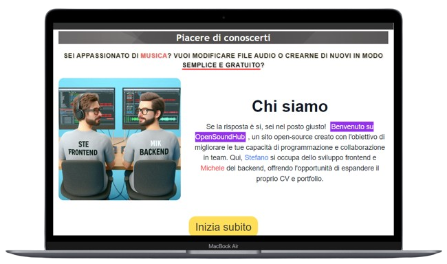
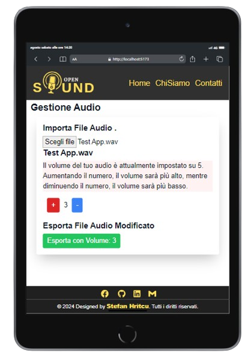
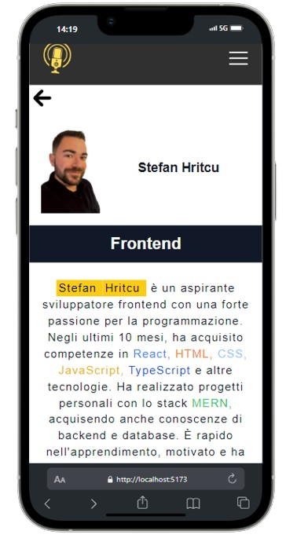

<h1 align="center">Ciao 👋, sono Stefan Hritcu</h1>
<h2 align="center">Front End Developer</h2>

<table align="center">
  <tr>
    <td>
      <section>
        <!-- Diminuisce la larghezza dell'immagine -->
        
      </section>
    </td>
    <td style="padding-left: 20px;">
      <h2>📋 Indice</h2>
      <!-- Utilizza una lista non ordinata per i link -->
      <ul style="list-style-type: none; padding: 0; margin: 0;">
        <!-- Applica stili inline per migliorare l'aspetto dei link -->
        <li style="margin-bottom: 10px;">
          <a href="#chi-sono">Chi Sono</a>
        </li>
        <li style="margin-bottom: 10px;">
          <a href="#esperienza-internazionale">Esperienza Internazionale</a>
        </li>
        <li style="margin-bottom: 10px;">
          <a href="#hard-skills">Hard Skills</a>
        </li>
        <li style="margin-bottom: 10px;">
          <a href="#soft-skills">Soft Skills</a>
        </li>
        <li style="margin-bottom: 10px;">
          <a href="#progetti">Progetti</a>
        </li>
        <li style="margin-bottom: 10px;">
          <a href="#contatti">Contatti</a>
        </li>
      </ul>
      

    </td>
  </tr>
</table>

---

## Chi Sono

Sono un Frontend Developer autodidatta con circa un anno di esperienza nello sviluppo di applicazioni web interattive e responsive. Dopo aver vissuto in Germania, sono tornato in Italia ad agosto 2024 per iniziare la mia prima esperienza lavorativa come sviluppatore frontend. Durante il mio percorso di apprendimento, ho collaborato a progetti open source online, lavorando con altri sviluppatori e affinando le mie competenze. Ho recentemente trovato il mio primo cliente grazie a un approccio strutturato per raccogliere informazioni dettagliate sulle sue esigenze, e attualmente sono impegnato nella creazione del suo sito web, dedicandomi con passione per offrire la soluzione migliore.

---

## Esperienza Internazionale

Ho avuto il privilegio di vivere e lavorare in diversi paesi europei, il che mi ha permesso di sviluppare una mentalità aperta e adattabile:

- **Italia**: Dall'età di 8 ai 20 anni
- **Spagna**: Dai 20 ai 21 anni
- **Germania**: Dai 21 anni fino a luglio 2024
- **Italia (Bracciano, RM)**: Da agosto 2024 con il focus di iniziare la mia prima esperienza lavorativa come programmatore

---

## Hard Skills

  
  
  
  
  
  
  
  
  
  
  
  
  

---

## Soft Skills

- **PNL**: Corso Practitioner in Programmazione Neuro Linguistica
- **Utilizzo di ChatGPT** per migliorare la produttività e risolvere problemi di sviluppo
- **Lingue**: Rumeno e Italiano (madrelingua), Tedesco e Spagnolo (ottime conoscenze), Inglese e Francese (conoscenze di base)
- **Esperienza in ambienti internazionali** e capacità di adattamento
- **Pensiero critico e problem solving**: Capacità di scomporre problemi complessi in parti gestibili
- **Mentalità algoritmica** per l'approccio alla risoluzione dei problemi
- **Esperienza lavorativa internazionale**: Romania, Germania, Italia, Francia e Spagna

---

## Progetti

### 03 - **OpenSoundHub** (Agosto 2024)

  
  
  

**GitHub Repository/ Codice:** [OpenSoundHub](https://github.com/StefanHritcu/OpenSoundHub-Collaborative-Full-Stack-Audio-Processing-Platform) **Qui troverai la descrizione completa**

**Link del sito con Netlify:** a breve disponibile... (31.08.24).

#### Descrizione:
Progetto full-stack realizzato in collaborazione online assieme a un programmatore backedn. Mi sono occupato dello sviluppo frontend dove mi sono occupato nella realizzazione del sito web e affrontare sfide legate all'integrazione tra frontend e backend comprendendo che tipo di dato bisognava passarci tra me e il backend superandole grazie a una comunicazione efficace.

#### Tecnologie utilizzate:

- **Frontend (io):** React, HTML CSS
- **Backend (Michele):** Python, Django
- **Deployment:** Netlify (solo lato frontend)

### 02 - **WeatherApi** (Luglio 2024)

  
  
  

**GitHub Repository/ Codice:** [WeatherApi](https://github.com/StefanHritcu/WeatherApi) **Qui troverai la descrizione completa**

**Link del sito con Netlify:** [weather-api-by-hritcu.netlify.app](https://weather-api-by-hritcu.netlify.app/).

#### Descrizione:
Un'applicazione per visualizzare le previsioni meteo basate su dati in tempo reale ottenuti tramite le API di OpenWeather.

#### Tecnologie utilizzate:

- **Frontend:** React, JavaScript, HTML, CSS/TAILWIND.CSS
- **Backend:** Assente.
- **Deployment:** Netlify (solo lato frontend)

- - ### 01 - Progetto Ristorante con Stack MERN  (Maggio 2024)

  
  
  

**GitHub Repository/ Codice:** [Progetto Ristorante Stack MERN](https://github.com/StefanHritcu/Progetto-Ristorante-Stack-MERN) **Qui troverai la descrizione completa**

**Link del sito con Netlify:** [ristorantemern.netlify.app](https://main--ristorantemern.netlify.app/).

#### Descrizione:
Un'applicazione per la gestione di un ristorante sviluppata con lo stack MERN (MongoDB, Express.js, React, Node.js). I clienti possono effettuare prenotazioni online, mentre i dipendenti e il proprietario del ristorante hanno accesso a una dashboard per gestire le prenotazioni e altre funzionalità operative.

#### Tecnologie utilizzate:

- **Frontend:** React, JavaScript/ES6+, HTML, CSS/TAILWIND.CSS
- **Backend:** Node.js, Express.js, MongoDB
- **Deployment:** Netlify (solo lato frontend)

---

## -----------------------------------------------> Contatti <-----------------------------------------------

Per ulteriori informazioni sui progetti o per parlare di opportunità, puoi contattarmi tramite:

- **LinkedIn:** [Stefan Hritcu](https://www.linkedin.com/in/stefan-hritcu-93b67028a/)
- **Email:** [shritcu@proton.me](mailto:stefano.94h@gmail.com)
- **Facebook:** https://www.facebook.com/profile.php?id=61563101911367

  

  

